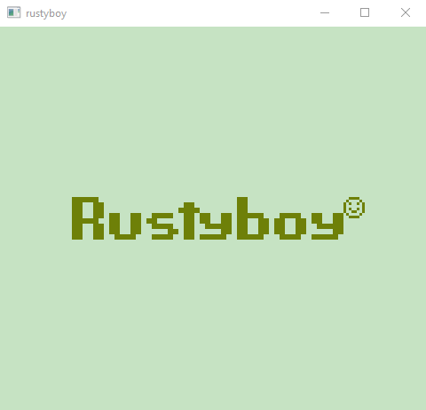
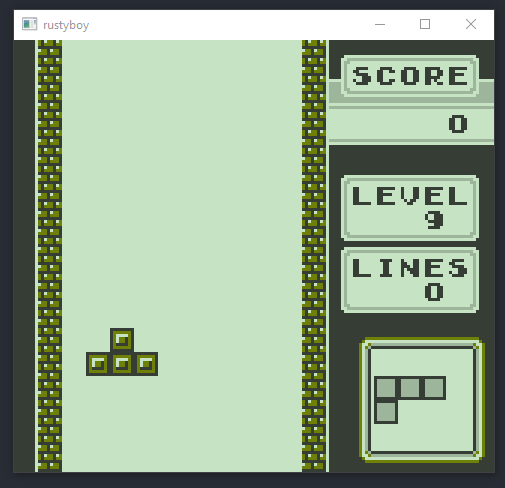

# rustyboy
A GB emulator as a learning project

# Implementation Status
Tetris is playable

* Color Palettes are not implemented yet
* OBJ / sprites are just implemented good enough so tetris is playable
* No sound
* ROM bank switching and RAM cardrides are not implemented

# USAGE
rboy game.rom [boot.rom]

* Emulator starts in debug mode, press t[ENTER], c[ENTER] to run
* boot rom is optional, by default RBOY_ROM.bin will be loaded

## Keys
* Left 
* Right
* Up
* Down
* Keyboard A - Button B
* Keyboard S - Button A
* Space - Select
* Enter - Start

# RESOURCES
* Main Inspiration: https://media.ccc.de/v/33c3-8029-the_ultimate_game_boy_talk
* http://marc.rawer.de/Gameboy/Docs/GBCPUman.pdf
* https://www.pastraiser.com/cpu/gameboy/gameboy_opcodes.html
* https://github.com/retrio/gb-test-roms
